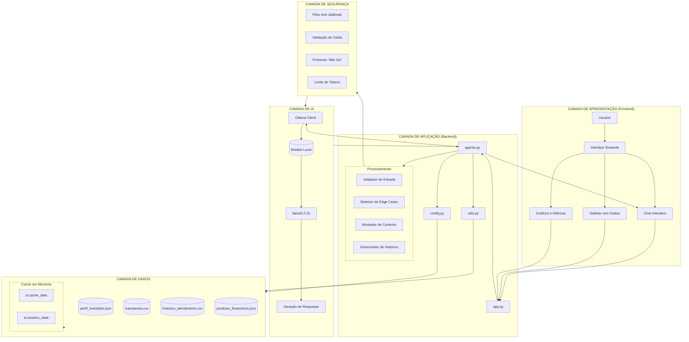

# 💰 Edu - Agente Financeiro Inteligente com IA Generativa

## 📝Contexto

Os assistentes virtuais nesse setor, estão evoluindo de simples chatbots reativos para **agentes inteligentes e proativos**. Neste desafio, idealizar e prototipar um agente financeiro que utiliza IA Generativa para :

- **Antecipar necessidades** ao invés de apenas responder perguntas
- **Personalizar** sugestões com base no contexto de cada cliente
- **Cocriar soluções** financeiras de forma consultiva
- **Garantir segurança** e confiabilidade nas respostas (anti-alucinação)

> [!TIP]
> Na pasta [`examples/`](./examples/) você encontra referências de implementação para cada etapa deste desafio.

---

## 🎯 Funcionalidades

O que o Edu faz :

- ✅ Explica conceitos financeiros de forma simples
- ✅ Usa dados do cliente como exemplos práticos
- ✅ Responde dúvidas sobre produtos financeiros
- ✅ Analisa padrões de gastos de forma educativa

O que o Edu NÃO faz :

- ❌ Não recomenda investimentos específicos
- ❌ Não acessa dados bancários sensíveis
- ❌ Não substitui um profissional certificado

## 🔐 Princípios de Segurança

- Nunca recomenda investimentos - Apenas educa
- Baseado em dados reais - Sem alucinações
- Edge cases tratados - Perguntas fora do escopo
- Transparência - Assume quando não sabe
- Privacidade - Dados locais, sem nuvem

> [!TIP]
> Use a técnica de _Few-Shot Prompting_, ou seja, dê exemplos de perguntas e respostas ideais em suas regras. Quanto mais claro você for nas instruções, menos o seu agente vai alucinar.

---

## 🏗️ Detalhamento da Arquitetura


---

## 📋 Resumo da Arquitetura

Camadas da Aplicação

Apresentação (Streamlit)
- Interface de chat com o usuário
- Gráficos e métricas em tempo real
- Sidebar com dados do cliente

Aplicação (Python)
- Lógica principal do agente Edu
- Processamento de perguntas
- Gerenciamento de contexto

IA (Ollama + Llama 3.2)
- Modelo local para geração de respostas
- Temperatura baixa para consistência
- Respostas concisas e educativas

Dados (JSON + CSV)
- Perfil do cliente
- Histórico de transações
- Catálogo de produtos

Segurança (Validações)
- Filtros de entrada
- Detecção de edge cases
- Protocolo "Não sei"      

---

## 📁 Estrutura do Projeto

```
edu-agente-financeiro/
│
├── 📂 src/                          # Código fonte da aplicação
│   ├── app.py                        # Interface Streamlit (front-end)
│   ├── agente.py                      # Lógica principal do agente Edu
│   ├── config.py                       # Configurações e variáveis de ambiente
│   ├── utils.py                         # Funções auxiliares (carregar dados, validações)
│   └── requirements.txt                 # Dependências do projeto
│
├── 📂 data/                          # Base de conhecimento do agente
│   ├── perfil_investidor.json          # Perfil do cliente (João Silva)
│   ├── transacoes.csv                   # Histórico de transações financeiras
│   ├── historico_atendimento.csv        # Atendimentos anteriores
│   └── produtos_financeiros.json        # Catálogo de produtos financeiros
│
├── 📂 docs/                           # Documentação do projeto
│   ├── 01-documentacao-agente.md       # Persona, caso de uso e arquitetura
│   ├── 02-prompts.md                    # System prompt e exemplos de interação
│   ├── 03-edge-cases.md                  # Tratamento de casos extremos
│   ├── 04-metricas.md                     # Avaliação e métricas de qualidade
│   └── 05-pitch.md                        # Roteiro do pitch de 3 minutos
│
├── 📂 examples/                        # Exemplos de uso e referências
│   ├── perguntas_comuns.txt              # FAQ e perguntas frequentes
│   └── simulacoes.md                      # Exemplos de simulações financeiras
│
├── .env                                # Variáveis de ambiente (chave da API)
├── .gitignore                           # Arquivos ignorados pelo Git
└── README.md                             # Documentação principal do projeto
````
---

## Como Executar

# 1. Instalar Ollama

```bash
# Baixar em: ollama.com
ollama pull gpt-oss
ollama serve
```

# 2. Instalar Dependências

```bash
pip install streamlit pandas requests
```

# 3. Rodar o Edu

```bash
streamlit run src/app.py
```
---

## 💻 Requisitos Técnicos

- Python: 3.10 ou superior
- Streamlit: 1.28.0
- Ollama: 0.1.32+
- Modelo: Llama 3.2 1B (ou similar)
- Memória: 4GB RAM mínimo
- Armazenamento: 1GB para o modelo

--- 

## 🛡️ Segurança e Boas Práticas

- ✅ Anti-alucinação: Respostas baseadas APENAS nos dados fornecidos
- ✅ Edge Cases: Tratamento para perguntas fora do escopo
- ✅ Validação de Entrada: Filtro para evitar jailbreak
- ✅ Timeout: Prevenção contra travamentos
- ✅ Cache: Otimização de performance

---

## 📚 Base de Conhecimento

| Arquivo | Formato | Para que serve no Edu ? |
|---------|---------|-----------|
| `transacoes.csv` | CSV | Analisar o histórico de transações e usar essas informações de forma a alertar ou orientar o cliente |
| `historico_atendimento.csv` | CSV | Histórico de atendimentos anteriores, ou seja, dar continuidade ao atendimento de forma mais eficiente  |
| `perfil_investidor.json` | JSON | Personalizar as recomendações e explicações sobre as dúvidas e as necessidades de aprendizado do cliente |
| `produtos_financeiros.json` | JSON | Conhecer os produtos e serviços disponíveis para que eles possam ser explicados e recomendados ao cliente |

---

## 🧮 Avaliação e Métricas

Como é avaliada a qualidade do agente :

**Métricas Sugeridas:**
- Precisão/assertividade das respostas
- Taxa de respostas seguras (sem alucinações)
- Coerência com o perfil do cliente

📄 **Template:** [`docs/04-metricas.md`](./docs/04-metricas.md)

---

### 🎤 Pitch

Grave um **pitch de 3 minutos** (estilo elevador) apresentando :

- Qual problema seu agente resolve ?
- Como ele funciona na prática ?
- Por que essa solução é inovadora ?

📄 **Template:** [`docs/05-pitch.md`](./docs/05-pitch.md)

---

## 🛠️ Ferramentas Sugeridas

Todas as ferramentas abaixo possuem versões gratuitas:

| Categoria | Ferramentas |
|-----------|-------------|
| **LLMs** | [ChatGPT](https://chat.openai.com/), [Copilot](https://copilot.microsoft.com/), [Gemini](https://gemini.google.com/), [Claude](https://claude.ai/), [Ollama](https://ollama.ai/) |
| **Desenvolvimento** | [Streamlit](https://streamlit.io/), [Gradio](https://www.gradio.app/), [Google Colab](https://colab.research.google.com/) |
| **Orquestração** | [LangChain](https://www.langchain.com/), [LangFlow](https://www.langflow.org/), [CrewAI](https://www.crewai.com/) |
| **Diagramas** | [Mermaid](https://mermaid.js.org/), [Draw.io](https://app.diagrams.net/), [Excalidraw](https://excalidraw.com/) |

---

## ✨ Dicas Finais

1. **Comece pelo prompt:** Um bom system prompt é a base de um agente eficaz
2. **Use os dados mockados:** Eles garantem consistência e evitam problemas com dados sensíveis
3. **Foque na segurança:** No setor financeiro, evitar alucinações é crítico
4. **Teste cenários reais:** Simule perguntas que um cliente faria de verdade
5. **Seja direto no pitch:** 3 minutos passam rápido, vá ao ponto

## 🙏 Agradecimentos
- DIO
- Bradesco
- Bootcamp GenAI - Módulo : Desafio Final
- Prof : Venilton Falvo Jr.

## Autor
- Marcus Guedes
- Linkedin : https://www.linkedin.com/in/marcusguedes/
- GitHub : https://github.com/MCLG1661 
